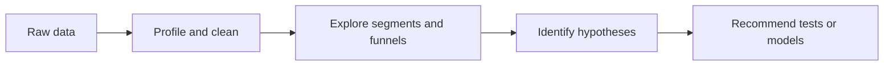

# Exploratory Analysis

> Finding the patterns, anomalies, and decision questions worth modeling.

## Analytical lens

| Question | Exploration | Action it informs |
|---|---|---|
| Which channels drive quality? | Volume, conversion rate, CAC, ROAS | Budget allocation |
| Where does the funnel leak? | Landing page → inquiry → application cohorts | UX and nurture tests |
| Which audiences behave differently? | Geography, device, program, source segmentation | Targeting and messaging |
| What changed? | Trend, seasonality, anomaly detection | Monitoring and investigation |

## Deliverables

- Reproducible data profile and metric definitions
- Funnel and cohort views
- Channel-performance and segmentation insights
- A prioritized hypothesis backlog with measurable success criteria

## Tools

Python · Pandas · SQL · BigQuery · Tableau/Plotly · Jupyter · Streamlit.

> Portfolio blueprint: exploratory findings create hypotheses; experiments and validated models establish causality.

## Example analysis plan

| Phase | Questions | Output |
|---|---|---|
| Data audit | What is the grain? Are IDs unique? What is missing or delayed? | Quality report and analysis-ready table |
| Univariate review | What are the ranges, skew, outliers, and category coverage? | Distribution and exception views |
| Segment analysis | Which sources, regions, devices, products, or cohorts differ? | Ranked opportunity segments |
| Funnel analysis | Where do users drop and where does quality change? | Stage-level conversion map |
| Hypothesis design | Which patterns are actionable and testable? | Prioritized experiment/model backlog |

## Analytical patterns to investigate

- **Mix shift:** overall conversion changes because the composition of traffic changed.
- **Simpson's paradox:** an aggregate trend reverses after segmentation.
- **Survivorship bias:** analysis excludes users who never reached a recorded downstream stage.
- **Seasonality versus intervention:** a campaign launch overlaps a predictable demand cycle.
- **Metric denominator drift:** conversion rate changes because eligibility or tracking changed.

## Interview-ready talking points

- **How I start:** I define the business decision, observation grain, target population, time window, and metric denominator before plotting.
- **How I treat missing values:** missingness can be a pipeline defect, a structural state, or a behavioral signal; I do not impute until I know which.
- **How I handle outliers:** validate whether they are errors, rare but valid events, or the key business segment before removing them.
- **How EDA becomes action:** each material pattern ends in a decision, experiment, model feature, tracking fix, or explicit no-action conclusion.

## Business impact framework

| Opportunity | Baseline | Proposed action | Measurement |
|---|---|---|---|
| Low-quality lead source | Qualified conversion rate | Adjust targeting or landing experience | Incremental qualified leads and CAC |
| Funnel-stage drop | Stage conversion | UX/nurture experiment | Absolute lift and downstream value |
| High-value cohort | Revenue/LTV | Tailored acquisition or retention | Incremental profit and retention |

Relevant professional context includes analysis across **500K+ users**, improving CTR by **15%**, and increasing retention efficiency by **20%**. These are experience-level outcomes, not results generated by this blueprint.

## Reproducibility checklist

- Metric dictionary and declared table grain
- Fixed analysis window and extraction timestamp
- Versioned SQL/notebook and deterministic transformations
- Saved data-quality tests and assumptions
- Clear separation of observation, inference, and causal claim

## Next build steps

Add a synthetic dataset, SQL extraction, profiling notebook, Plotly dashboard, executive summary, and testable hypothesis backlog.
