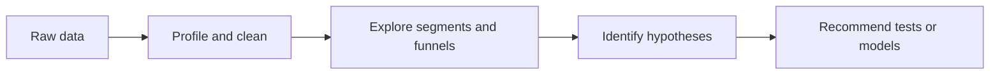

# Exploratory Analysis

> Finding the patterns, anomalies, and decision questions worth modeling.

## Analytical lens

| Question | Exploration | Action it informs |
|---|---|---|
| Which channels drive quality? | Volume, conversion rate, CAC, ROAS | Budget allocation |
| Where does the funnel leak? | Landing page → inquiry → application cohorts | UX and nurture tests |
| Which audiences behave differently? | Geography, device, program, source segmentation | Targeting and messaging |
| What changed? | Trend, seasonality, anomaly detection | Monitoring and investigation |

## Deliverables

- Reproducible data profile and metric definitions
- Funnel and cohort views
- Channel-performance and segmentation insights
- A prioritized hypothesis backlog with measurable success criteria

## Tools

Python · Pandas · SQL · BigQuery · Tableau/Plotly · Jupyter · Streamlit.

> Portfolio blueprint: exploratory findings create hypotheses; experiments and validated models establish causality.
