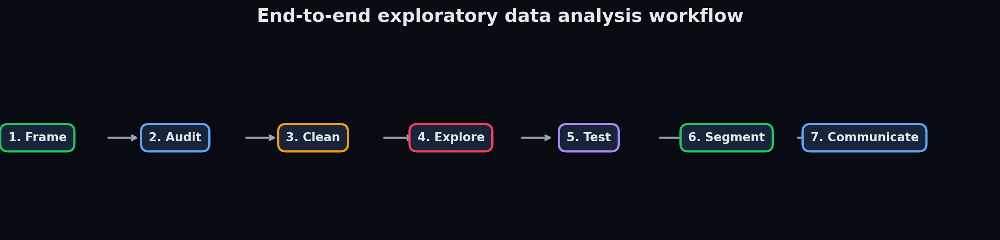
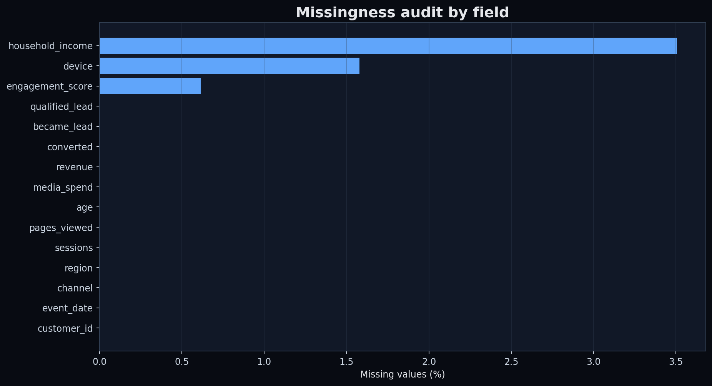
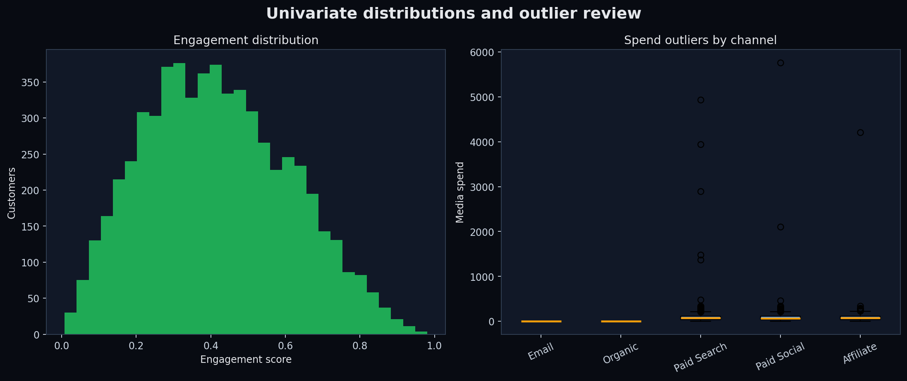
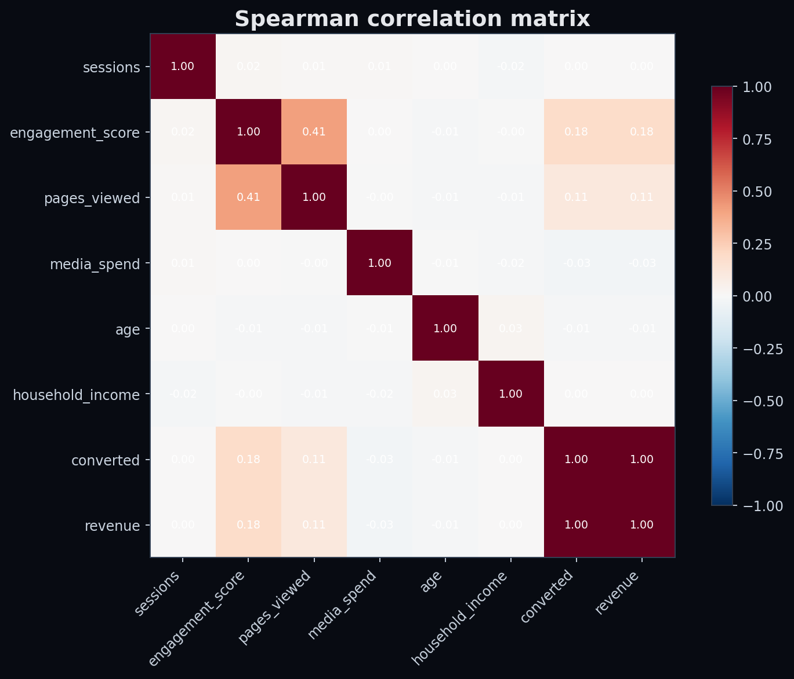
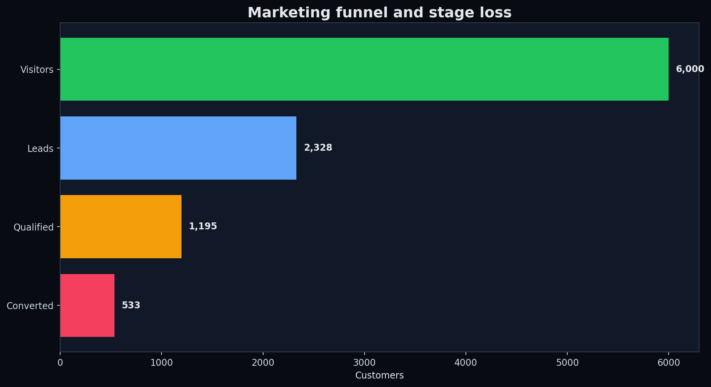
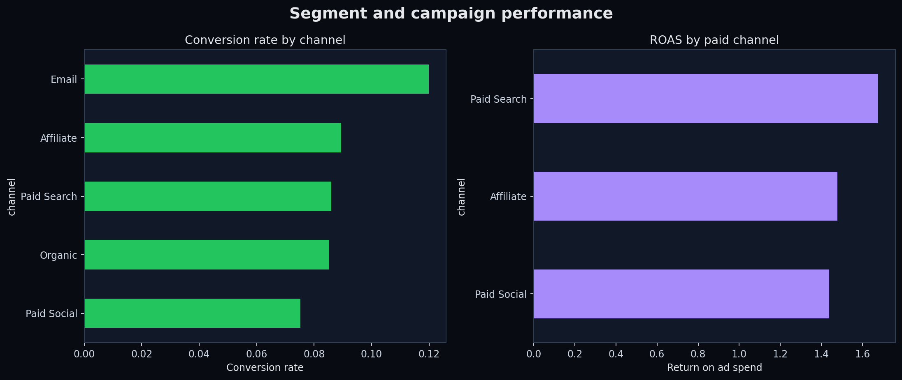
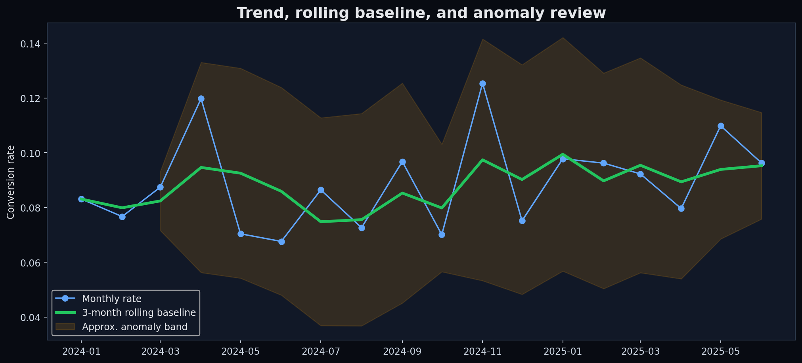
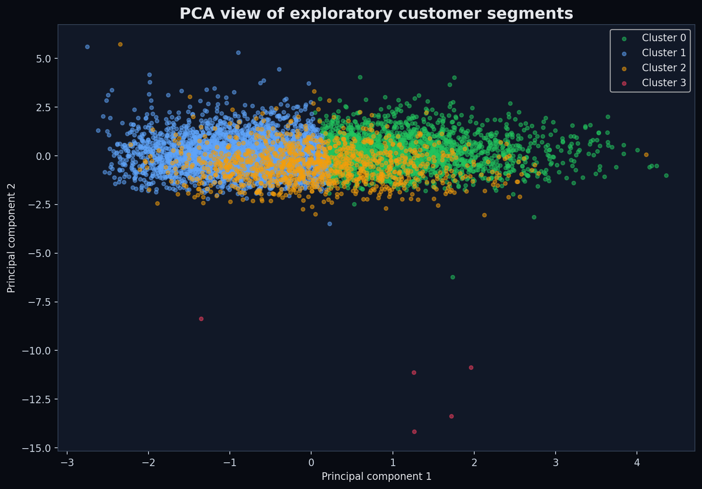

# EDA Techniques: Complete Step-by-Step Walkthrough

This tutorial documents the full analytical workflow implemented in `eda_case_study.py`. Each step explains what to do, why it matters, how it is implemented, how to interpret it, and what decision it can support.



## Step 1 — Define the problem and analytical grain

**Technique:** analytical framing and metric definition.

1. State the business decision: improve acquisition quality and funnel conversion.
2. Define one row as one customer acquisition observation.
3. Fix the population and analysis window.
4. Define numerator and denominator for every rate.
5. Separate descriptive, inferential, predictive, and causal questions.

**Why:** an attractive chart is misleading when its population, grain, or denominator is unstable.

**Output:** business question, unit of analysis, target population, metric dictionary, and time boundary.

## Step 2 — Inspect structure and data types

**Techniques:** shape inspection, schema profiling, cardinality analysis, memory review, and date-boundary validation.

```python
df.shape
df.dtypes
df.nunique(dropna=True)
df.memory_usage(deep=True)
df["event_date"].agg(["min", "max"])
```

Check whether identifiers are unique, dates parsed correctly, numeric fields accidentally stored as text, and categorical fields have plausible coverage.

## Step 3 — Test data quality and invariants

**Techniques:** duplicate detection, key validation, domain constraints, referential rules, and funnel invariants.

```python
df.duplicated().sum()
df["customer_id"].duplicated().sum()
assert (df["converted"] <= df["qualified_lead"]).all()
assert (df["qualified_lead"] <= df["became_lead"]).all()
```

Do not remove duplicates until you know whether they are ingestion errors, legitimate repeated events, or an incorrect assumption about table grain.

## Step 4 — Analyze missingness

**Techniques:** null profiling, missingness indicators, group-wise imputation, explicit missing categories, and missing-mechanism reasoning.



1. Rank fields by missing percentage.
2. Test whether missingness varies by channel, region, date, or outcome.
3. Classify nulls as structural, random, behavioral, or pipeline defects.
4. Preserve an `income_missing` indicator.
5. Impute income within region/channel groups and engagement with a robust median.
6. Represent an unknown device as an explicit category.

Never impute purely to eliminate blanks; the fact that a value is missing may itself be informative.

## Step 5 — Perform univariate analysis

**Techniques:** descriptive statistics, quantiles, distribution shape, skewness, kurtosis, frequency tables, histograms, and boxplots.



For numeric variables, compare mean versus median, inspect the 1st/99th percentiles, and review skew and kurtosis. For categorical variables, inspect counts, proportions, rare levels, unexpected labels, and high cardinality.

**Interpretation:** income and revenue are right-skewed, so median/quantiles and log transforms are often more informative than the mean alone.

## Step 6 — Investigate outliers

**Techniques:** Tukey IQR fences, median absolute deviation, robust z-scores, visual validation, and domain review.

```python
lower = q1 - 1.5 * iqr
upper = q3 + 1.5 * iqr
robust_z = 0.6745 * (x - median) / mad
```

Classify each extreme as a data error, rare valid observation, operational incident, or high-value segment. Flag first; remove only with a documented reason.

## Step 7 — Explore bivariate numeric relationships

**Techniques:** Pearson correlation, Spearman correlation, scatterplots, grouped distributions, and nonlinear-pattern review.



- Pearson measures linear association and is sensitive to extreme values.
- Spearman measures monotonic rank association and is more robust to skew.
- Correlation does not establish causality and can hide nonlinear or segmented relationships.

## Step 8 — Explore categorical relationships

**Techniques:** cross-tabulation, row/column normalization, conversion-rate comparisons, chi-square testing, and Cramér’s V.

Use normalized tables so unequal segment sizes do not masquerade as performance. Cramér’s V summarizes association strength from 0 to 1 but does not explain direction.

## Step 9 — Analyze funnels and denominators

**Techniques:** sequential stage counts, stage-to-stage rates, overall rates, drop-off, and invariant checks.



Always report both stage conversion and overall conversion. A strong lead-to-qualified rate can coexist with weak visitor-to-lead performance.

## Step 10 — Compare segments and campaigns

**Techniques:** group-by aggregation, weighted rates, efficiency metrics, mix-shift analysis, and small-sample checks.



Calculate customer volume, leads, qualified leads, conversions, revenue, spend, conversion rate, qualification rate, CPA, and ROAS. Compare absolute impact with efficiency; a small efficient channel may not be scalable.

## Step 11 — Examine time, seasonality, and anomalies

**Techniques:** time aggregation, rolling averages, rolling standard deviations, z-score flags, seasonality review, and change-point investigation.



Distinguish demand seasonality, channel-mix shifts, tracking changes, and real interventions. An anomaly is a prompt for investigation, not automatically an error.

## Step 12 — Run statistical hypothesis checks

**Techniques:** Welch’s t-test, Mann–Whitney U, chi-square independence, and Kruskal–Wallis.

| Test | Use |
|---|---|
| Welch t-test | Compare means when variances may differ |
| Mann–Whitney U | Compare ranks without a normality assumption |
| Chi-square | Test association between categorical variables |
| Kruskal–Wallis | Compare distributions across multiple groups |

Report effect size, confidence interval, sample size, assumptions, and practical importance alongside p-values. Multiple exploratory tests increase false-positive risk.

## Step 13 — Engineer exploratory features

**Techniques:** calendar extraction, log transforms, ratios, missingness flags, binning, and interactions.

Examples include month, revenue per session, log income, and channel-level funnel rates. Avoid target leakage: features created after conversion cannot explain or predict conversion at acquisition time.

## Step 14 — Explore multivariate structure

**Techniques:** standardization, one-hot encoding, PCA, K-means, cluster profiling, and multicollinearity review.



PCA provides a compact view of correlated variables; K-means generates exploratory segment hypotheses. Validate stability, interpretability, size, and business usefulness before calling clusters personas.

## Step 15 — Check bias and analytical traps

Review:

- Simpson’s paradox after segmentation
- Survivorship and selection bias
- Metric denominator drift
- Leakage from downstream fields
- Class imbalance
- Unequal observation windows
- Multiple-comparison risk
- Confounding and non-causal interpretation
- Tracking changes and instrumentation gaps

## Step 16 — Communicate decisions and limitations

Every material observation should end as one of:

1. A tracking or data-quality fix
2. A business decision
3. A controlled experiment
4. A model feature or modeling hypothesis
5. A documented no-action conclusion

Separate **observation** (“Email has the highest historical conversion rate”) from **inference** (“the difference is unlikely under the null”) and **causal claim** (“moving budget to Email will incrementally increase conversions”). Only a suitable experiment or causal design supports the last statement.

## Step 17 — Make the analysis reproducible

Record the extraction timestamp, source/version, data grain, metric definitions, cleaning rules, random seeds, package versions, generated artifacts, tests, and limitations. Run:

```bash
python generate_data.py
python eda_case_study.py
python generate_screenshots.py
pytest -q
```

The workflow produces auditable CSV profiles, interactive HTML charts, PNG screenshots, a JSON executive summary, and automated quality checks.

